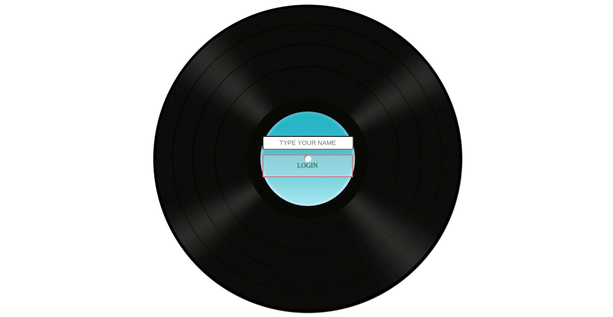

# Seja bem vindo ao Project-Trybetunes! :headphones:

## Descrição do Projeto
> FRONT-END
<p>:rocket: O objetivo da aplicação foi reproduzir músicas de diversas bandas, fazendo requisição para uma API :musical_note:</p>
<p> Esse foi um projeto muito desafiador e um dos quais eu mais absorvi a lógica do React :muscle:<p>

### Funcionalidades :dart:

- Tela de login
- Pesquisar por uma banda ou artista
- Listar os álbuns disponíveis dessa banda ou artista
- Visualizar as músicas de um álbum selecionado
- Reproduzir uma prévia das músicas deste álbum
- Favoritar e desfavoritar músicas
- Ver a lista de músicas favoritas
- Ver o perfil da pessoa logada
- Editar o perfil da pessoa logada

### Tecnologias Utizadas :nerd_face:

- [x] React.JS / componentes de Classe
- [x] React-router

### GIF da aplicação :point_down:
> Obs: sem som!



## Instruções 

> Rode o comando em seu terminal 

```
git clone git@github.com:JoaoVFerreira/Project-Trybetunes.git
```

> Entre na pasta do projeto 

```
cd Project-Trybetunes
```

> Instale as dependências

```
npm install
```

> Rode o comando npm start

```
npm start
```

### Obrigado e Curte as músicas :man_dancing:
